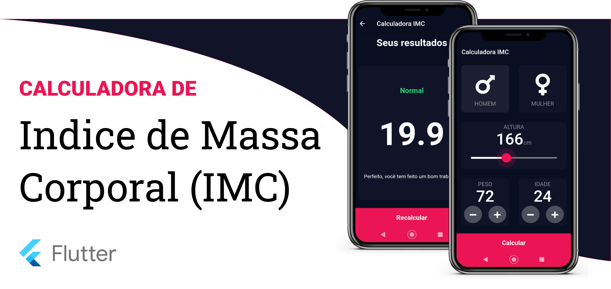

# BMI Calculator 💪

## About this project

This project is made on the The App Brewery's Complete Flutter Development Bootcamp, the purpose here is totally educational,
just build a Flutter app and learning a lot of features of this framework. 

## Links

The project is inspired by the beautiful designs made by [Ruben Vaalt](https://dribbble.com/shots/4585382-Simple-BMI-Calculator), and was made possible thanks to the teaching of Angela Yu, check his course on [Udemy](https://www.udemy.com/course/flutter-bootcamp-with-dart/) or search directly on her [website](https://www.appbrewery.co/)

## Install
1. Download this course
2. Download the dependencies of pubspec.yaml
3. Check if you have a real device connected or any emulator
4. 'flutter run' or start the aplication with your IDE

